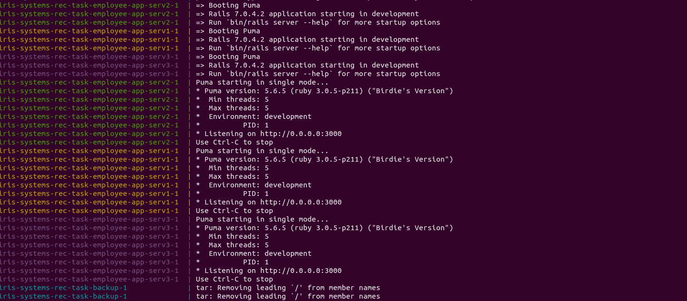

# Dockerizing

The given rails application is dockerized by first writing a Dockerfile for the application at <code>docker/app/Dockerfile</code> and then writing a <code>docker-compose.yaml</code> at the root directory of the application to easily build and run the containers for the application and the database.

## Application

### Dockerfile

To build the image for the rails application, the base image chosen is <code>ruby:3.0.5</code>. A directory called <code>/app/</code> is created and set as the working directory by:
```
RUN mkdir /app
WORKDIR /app
```
The Gemfile is copied into the working directory, the gems installed and the assets are precompiled by:
```
ADD Gemfile /app/Gemfile
ADD Gemfile.lock /app/Gemfile.lock

RUN bundle install
RUN bundle exec rails assets:precompile
```
Lastly, the rails application is ececuted on port 3000:
```
CMD ["bundle", "exec", "rails", "s", "-p", "3000", "-b", "0.0.0.0"]
```

### docker-compose.yaml

The application service is given the name <code>employee-app</code>.
Although the Dockerfile has a lot of details, the complete details of the container are mentioned in <code>docker-compose.yaml</code>.<br>
Since the Dockerfile is located in a subfolder of the application root folder, it cannot access the application data. To resolve this, the context of the Dockerfile build can be set as:
```
employee-app:
    build:
      context: .
      dockerfile: docker/app/Dockerfile
```
The application (located in the same location as <code>docker-compose.yaml</code>) is then mounted to the container as a volume at <code>/app/</code> and given read-write permissions with:
```
volumes:
    - .:/app:rw
```
The next section declares the environment variables related to the database (database user, password, name, host container) to be used by <code>config/database.yml</code>:
```
environment:
    DB_USER: root
    DB_PASSWORD: password
    DB_NAME: employee
    DB_HOST: employee-db
```
The next section ensures this container is created only after creating the database container and also exposes the port 3000 of the container (where the rails application is running) at port 8080 of the host machine:
```
depends_on:
    - employee-db
ports:
    - 8080:3000
```
## Database
There is no need for a Dockerfile for the database image since the default <code>mysql:5.7</code> image can be used with a few tweaks.
### docker-compose.yaml
The database service is given the name <code>employee-db</code>, the same name as mentioned in the <code>depends_on</code> section of the <code>employee-app</code> service. Then, the <code>image</code> allows to mention the image to be used which is set to <code>mysql:5.7</code> since that is the image of choice. Then, the database is given a name (same name as in <code>DB_NAME</code>) and the password is set with:
```
employee-db:
    image: mysql:5.7
    environment:
      MYSQL_ROOT_PASSWORD: password
      MYSQL_DATABASE: employee
```
### config/database.yml
To set the configuration of the database on launch, the file is edited to take the values of the environment variables defined in <code>docker-compose.yaml</code>:
```
pool: <%= ENV.fetch("RAILS_MAX_THREADS") { 5 } %>
database: <%= ENV['DB_NAME'] %>
username: <%= ENV['DB_USER'] %>
password: <%= ENV['DB_PASSWORD'] %>
host: <%= ENV['DB_HOST'] %>
port: <%= ENV['DB_PORT'] %>
```
## Screenshots
### The containers running:
<br>
### The application accessed at <code>localhost:8080</code>:

