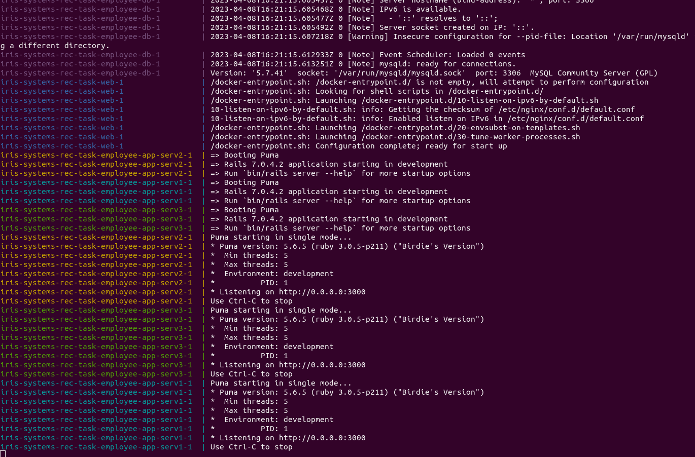
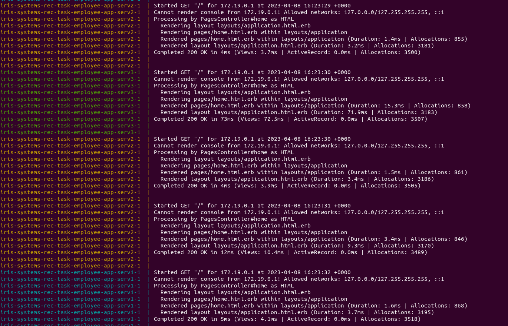

# Multiple Containers and Load Balancing

## 1. Multiple Containers

Multiple containers running the rails application are created by adding services in <code>docker-compose.yaml</code> with different names but having the same configuration. However, some changes are made to the application dockerfile and the <code>docker-compose.yaml</code> configuration to ensure that multiple containers can be run.

### Dockerfile
Instead of mounting the app source directory at <code>/app/</code>, the entire source code directory is copied into <code>/app/</code> with:
```
COPY . /app/
```
The <code>CMD ["bundle", "exec", ... ]</code> line is removed from the dockerfile and all the commands are now shifted to <code>docker-compose.yaml</code>.<br>

### docker-compose.yaml

The inital <code>employee-app</code> service is renamed to <code>employee-app-serv1</code>, and two new services, <code>employee-app-serv2</code>, and <code>employee-app-serv3</code> are created. All the services have the same configuration and access the same database.<br>
However, since the containers are started one after another, the first time a container is started, it creates a file <code>/app/tmp/pids/server.pid</code> storing the pid of the server. If this file is not removed, the subsequent containers will not be able to run and give a <code>server already running</code> error.<br>
This is fixed by executing commands upon running the container to remove the <code>/app/tmp/pids/server.pid</code> file to ensure the new server can launch. This is done with a new <code>command</code> section under each service:
```
command: bash -c "rm -f /app/tmp/pids/server.pid && bundle exec rails s -p 3000 -b '0.0.0.0'"
```

## 2. Load Balancing

Since now there are multiple containers running the same rails application, <code>nginx</code> can be used to configure load balancing to share requests between the 3 servers.<br>

### nginx.conf

The upstream, <code>web</code> is changed to include all the three defined services in <code>docker-compose.yaml</code> and optionally, weights can be provided to change the number of requests a server recieves as compared to other servers. This is done with:
```
upstream web {
    server employee-app-serv1:3000 weight=10;
    server employee-app-serv2:3000 weight=30;
    server employee-app-serv3:3000 weight=10;
}
```
Here, for demonstration, the server, <code>employee-app-serv2</code> is given a greater weight as compared to the other two servers. <code>nginx</code> defaults to a Round Robin algorithm to forward requests to the server.<br>
For this task, the <code>nginx</code> container is configured to listen to requests at port <code>5000</code> which is exposed to the host machine at port <code>8080</code>.

### docker-compose.yaml

Since there are three servers now, the <code>web</code> service is configured to depend on all the three services to ensure it starts once all the servers are up. This is done with:
```
depends_on:
    - employee-app-serv1
    - employee-app-serv2
    - employee-app-serv3
```
Port <code>5000</code> of the container is exposed at port <code>8080</code> of the host machine so the application can be accessed at <code>localhost:8080</code>.
```
ports:
    - 8080:5000
```
## Screenshots
### All the containers running:

### Load balancing:
Here it can be seen that <code>serv-2</code> is getting more requests than other servers since its weight was adjusted to be the greatest.<br>
