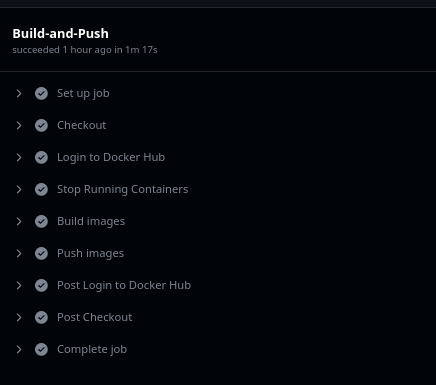
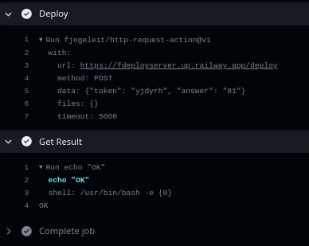

# CI/CD Pipeline

The GitHub CI/CD pipeline is set up using GitHub Actions.<br>
Before defining the jobs, <code>docker-compose.yaml</code> is edited to add the <code>image</code> section to every service defining the remote image to pull to or push from in the future. The remote images are:
1. <code>wolfram05/iris-sys-task_employee-app </code>
2. <code>wolfram05/iris-sys-task_web</code>
3. <code>wolfram05/iris-sys-task_backup</code>

<code>.github/Workflows/main.yml</code> specifies the entire process. The workflow is named <code>Push and deploy</code> with:
```
name: Push and deploy
```
The workflow is configured to run whenever there is a push to the <code>master</code> branch with:
```
on:
  push:
    branches:
      - "master"
```
Then, two jobs are defined within the file and they are as follows.

## Build-and-Push

The Build-And-Push job is responsible for building the docker images and pushing them onto dockerhub. For this purpose, two secrets, <code>DOCKERHUB_USERNAME</code> containing the username on dockerhub and <code>DOCKERHUB_TOKEN</code> containing the personal access token on dockerhub, are defined.<br>
Further, a <code>Makefile</code> is also defined as:
```
down:
	docker compose down --remove-orphans

build:
	docker compose build

push:
	docker compose push
```
This makes writing and configuring the CI/CD pipeline easier as the <code>main.yml</code> doesn't need to be edited if some of the commands need to be altered.<br>
The <code>Build-and-Push</code> job is configured to run on the <code>ubuntu-latest</code> image with:
```
runs-on: ubuntu-latest
```

The job has 5 steps, namely:
### 1. Checkout
The checkout step is simply used to checkout the <code>master</code> branch of the repository with:
```
name: Checkout
uses: actions/checkout@v3
```
The marketplace action <code>checkout@v3</code> is used for this purpose.<br>
### 2. Login to Docker Hub
This is used to login to docker hub on the runner using the <code>DOCKERHUB_USERNAME</code> and the <code>DOCKERHUB_TOKEN</code> already defined in the repository secrets. This can be done using the marketplace action <code>login-action@v2</code> by docker:
```
name: Login to Docker Hub
uses: docker/login-action@v2
with:
    username: ${{ secrets.DOCKERHUB_USERNAME }}
    password: ${{ secrets.DOCKERHUB_TOKEN }}
```
### 3. Stop Running containers
This is to stop the currently running containers on the runner and also removing orphaned containers (if some images were changed) so that the ports they are using are freed and don't interfere. The <code>down</code> target defined in the <code>Makefile</code> is used for this purpose.
```
name: Stop Running Containers
run: make down
```
### 4. Build images
The images are then built using the <code>build</code> target in the <code>Makefile</code>:
```
name: Build images
run: make build
```
### 5. Push images
The images are then pushed onto dockerhub using the <code>push</code> target in the <code>Makefile</code>:
```
name: Push images
run: make push
```
Now, whenever there is a push to the master branch, the images are automatically built and pushed to dockerhub.

### Screenshot
This is a screenshot of the job successfully running:


## Fake-Deploy
The second job defined is <code>Fake-Deploy</code> which uses the given api and gets am <code>OK</code> response from the server. This job is also run on the <code>ubuntu-latest</code> image.
There are 4 steps in this job, namely:
### 1. Challenge
This step involves using the api at <code>/challenge</code> to get a token and two numbers by making a <code>GET</code> request. This step is given an id of <code>challenge</code> to access the response of the request as an output of this step in further steps. A marketplace action, <code>fjogeleit/http-request-action@v1</code> is used for this purpose:
```
name: Challenge
id: challenge
uses: fjogeleit/http-request-action@v1
with:
    url: "https://fdeployserver.up.railway.app/challenge"
    method: 'GET'
```
### 2. Get and add numbers
This step involves using reponse recieved in the previous step and adding them up. This step is given the id <code>getnumbers</code> to access its outputs later on. The output of this step has the token name and the answer (sum of the numbers) to send back to the server at <code>/deploy</code>. Three environmental variables, <code>NUM1</code>, <code>NUM2</code> and <code>token</code> are used to store the data recieved in the response. The data is accessed by using the <code>fromJson</code> function available in GitHub Actions which allows accessing values of required fields in a json file:
```
name: Get and add numbers
id: getnumbers
env:
    NUM1: ${{ fromJson(steps.challenge.outputs.response).num1 }}
    NUM2: ${{ fromJson(steps.challenge.outputs.response).num2 }}
    token: ${{ fromJson(steps.challenge.outputs.response).token }}
```
Then, the output variables, <code>token</code> and <code>answer</code> are defined and set as the output. The <code>answer</code> variable is set to be the sum of <code>NUM1</code> and <code>NUM2</code>:
```
run: |
    echo "token=$token" >> $GITHUB_OUTPUT
    echo "answer=$(($NUM1 + $NUM2))" >> $GITHUB_OUTPUT
```
### 3. Deploy
This step involves sending a <code>POST</code> request at <code>/deploy</code> to the server with the output of the previous step. This step is given an id of <code>deploy</code> to access its output, which is the response from the server, in the next step. The request is made using the <code>fjogeleit/http-request-action@v1</code> marketplace action:
```
name: Deploy
id: deploy
uses: fjogeleit/http-request-action@v1
with:
    url: "https://fdeployserver.up.railway.app/deploy"
    method: 'POST'
    data: '{"token": "${{ steps.getnumbers.outputs.token }}", "answer": "${{ steps.getnumbers.outputs.answer }}"}'
```
### 4. Get Result
This step is to show the output of the previous step which is the response from the server:
```
name: Get Result
run: |
    echo ${{ steps.deploy.outputs.response }}
```
### Screenshot
This is a screenshot of the job successfully running and getting an <code>OK</code> response from the server:
