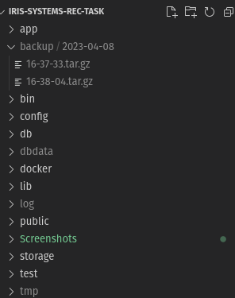

# Backup Daemon

For timely, backups of data a new backup daemon service <code>backup</code> is defined within <code>docker-compose.yaml</code>. The dockerfile for building the image is placed under <code>docker/backup_daemon/Dockerfile</code>.

### docker-compose.yaml

Similar to the pervious services, the context is defined to be the application root directory and the dockerfile is indicated with:
```
build:
    context: .
    dockerfile: ./docker/backup_daemon/Dockerfile
```
The service is made to be dependent on <code>employee-db</code> to ensure that the backup service runs only after the database service has begun:
```
depends_on:
    - employee-db
```
The persisted <code>./dbdata</code> folder is mounted as read only to the backup daemon container under <code>/data/</code>. Another directory, <code>./backup</code> is also mounted under <code>/backup/</code> to ensure that the backups are saved on the host machine.

### Dockerfile

The <code>python:3</code> image is used as the base image for the container.<br>
First, <code>tar</code> is installed onto the image with:
```
RUN apt-get install tar -y
```
Then, a <code>/script/</code> directory is created and set as the working directory with:
```
RUN mkdir /script
WORKDIR /script
```
Then, the backup python script, <code>backup.py</code> is copied into the <code>/scripts</code> folder with:
```
COPY docker/backup_daemon/backup.py /script/backup.py
```
Lastly, the script is run with:
```
CMD ["python", "backup.py"]
```
### docker/backup_daemon/backup.py

This script is the script responsible for the backup and is the daemon script running in the container.<br>
A <code>backup</code> function is defined which takes in a source directory and a destination directory (defaults to <code>/backup/</code>). It creates a new folder with the current date within the destination folder and then compresses the source directory into an archive with the name as the current time:
```
def backup(src_dir, dst_dir="/backup/"):
    now = datetime.datetime.now()
    folder = dst_dir + now.strftime("%Y-%m-%d") + "/"
    if not os.path.exists(folder):
        os.makedirs(folder)
    os.system("tar -zcf " + folder + now.strftime("%H-%M-%S") + ".tar.gz " + src_dir)
    print("Backup completed")
```
The source directory is set to be <code>/data/</code> and a loop is run which calls the backup function if the time is <code>1:00 AM</code> and if not, sleeps for 30 seconds before checking again:
```
src_dir = "/data/"
time.sleep(20)
while True:
    now = datetime.datetime.now()
    if now.hour == 1 and now.minute == 0:
        backup(src_dir)
    time.sleep(30)
```
This ensures that timely backups are taken everyday at <code>1:00 AM</code> and saved under the appropriate name and folder on the host machine.
## Screenshots
For the following screenshots, the backup frequency was increased to one every minute to show its working.
### The backup daemon container running:

### The backups taken:
