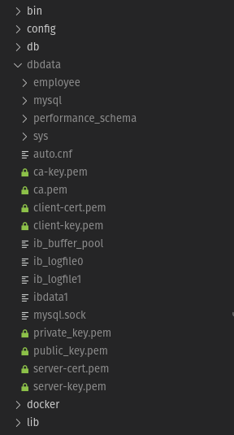

# Data Persistence

To ensure that between multiple session of running container, the data stored in the database is preserved, data persistence is used.<br>
This is done by having a folder on the host machine mounted as the directory where the data is stored in the database and providing it with read-write permissions. This ensures that, on launching the container again, the data from the previous session is still available since they were saved on the local machine.

### docker-compose.yaml
Data persistence is enabled with a simple addition to <code>docker-compose.yaml</code>. A directory called <code>.dbdata/</code> is mounted as a volume at <code>/var/lib/mysql</code> under the <code>employee-db</code> service with:
```
volumes:
    - ./dbdata:/var/lib/mysql
```
The <code>.dbdata/</code> directory is created automatically if it is not present.
## Screenshots
### Data persisted at <code>./dbdata</code>:
