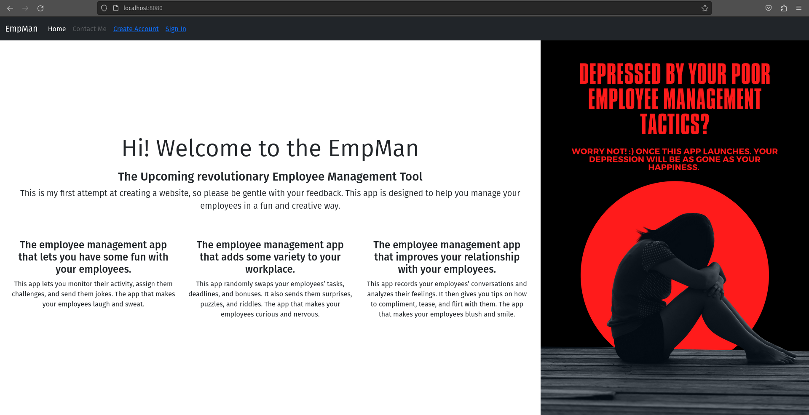

# Request Rate Limiting

The reverse proxy server can be configured to limit the number of requests recieved from a particular IP address by setting a maximum rate of requests. This can be done by editing the <code>nginx.conf</code> file.

### nginx.conf

For this task, the request rate limit is set to 10 requests per second. First, the <code>limit_req_zone</code> directive is used to define the rate limit parameters with:
```
limit_req_zone $binary_remote_addr zone=one:10m rate=10r/s;
```
This uses the address of the client in the binary format, thus saving space. 10 MB of space is reserved for tracking the number of requests and other details pertaining to every client address. Here, the parameters are defined under then name <code>one</code>.<br>
The rate limiting is then applied and activated within <code>location / {...}</code> as:
```
location / {
    limit_req zone=one;
    proxy_pass http://web;
    ...
}
```
## Screenshots
### The application accessed at <code>localhost:8080</code>:
<br><br>
Setting the rate limit to 1 request per second and reloading the website within a second causes the reverse proxy to block the request:<br><br>
